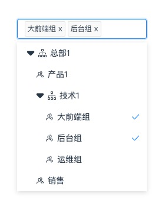

# @bieyanghong/vue-select-tree



## Installation
```
npm install @bieyanghong/vue-select-tree --save
```

### Usage
```js
import tree from '@bieyanghong/vue-select-tree'
import '@bieyanghong/vue-select-tree/lib/vue-tree-select.css'
Vue.use(tree)
```

### Example
```vue
<template>
  <div class="home">
    
    <tree width="240px" :dataSource="treeData" @change="handleChange" />
  </div>
</template>

<script>

export default {
  name: 'Home',

  data() {
    return {
      treeData: [
        {
          label: '总部1',
          id: 1,
          type: 'organization',
          children: [
            {
              label: '产品1',
              id: 2,
              type: 'department'
            },
            {
              label: '技术1',
              id: 3,
              type: 'organization',
              children: [
                {
                  label: '大前端组',
                  id: 4,
                  type: 'department'
                },
                {
                  label: '后台组',
                  id: 5,
                  type: 'department'
                },
              ]
            },
            {
              label: '销售',
              id: 7,
              type: 'department'
            },
          ]
        }
      ]
    }
  },
}
</script>
```

### Params
|  key                     | description            | default  |
|  ----------------------  | ---------------------  | -------- |
|  palceholder             | 选择框默认文字	          | 请选择    |
|  dropdownWidth           | 下拉弹框宽度             | 220px    |
|  mode                    | 单选还是多选，true为多选  | 220px    |
|  dataSource              | 数据源                  | []       |
|  allowSelectOrganization | 单选时是否可以选择部门     | false    |
|  defaltValue             | 单选时默认值             | number   |
|  value                   | 单选时指定选中            | number   |
|  defaltMulValue          | 多选时的默认值            | number[] |
|  mulValue                | 指定当前选中的条目         | number[] |
|  maxTagCount             | 最多显示多少个tag         | number   |